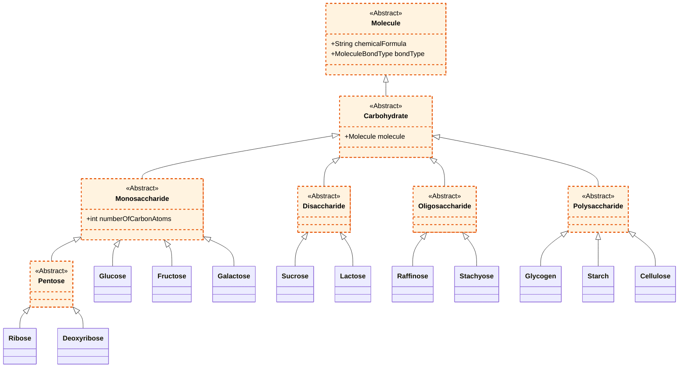

# Carbohydrates Overview

Carbohydrates (or saccharides) are organic biomolecules composed of carbon (C), hydrogen (H), and oxygen (O) atoms. They are critical for the biological processes of living organisms, acting primarily as a source of energy and as structural components.

## Classification

Carbohydrates are classified into four main groups based on their structural complexity (degree of polymerization):

1. **Monosaccharides:** The simplest form of carbohydrates, consisting of a single sugar unit. They are the fundamental building blocks for larger carbohydrates. Examples include Glucose, Fructose, Galactose, Ribose, and Deoxyribose.
2. **Disaccharides:** Formed when two monosaccharide molecules are joined by a glycosidic bond. Examples include Sucrose (table sugar) and Lactose (milk sugar).
3. **Oligosaccharides:** Saccharide polymers containing a small number (typically 3 to 10) of monosaccharides. Examples include Raffinose and Stachyose.
4. **Polysaccharides:** Complex, long-chain polymeric carbohydrates composed of many monosaccharide units. They serve structural or energy storage roles. Examples include Glycogen, Starch, and Cellulose.

## Conceptual UML Diagram

The following Mermaid diagram represents the structural hierarchy of carbohydrates as modeled in the project.

*Note: Following our UML conventions, conceptual class names omit code-level prefixes (like 'A' for abstract classes).*

