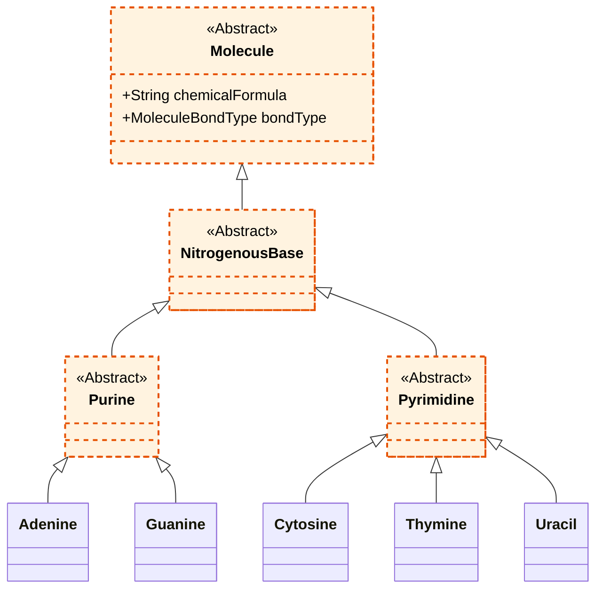

# Nitrogenous Bases Overview

Nitrogenous bases are organic molecules containing nitrogen that have the chemical properties of a base. They are fundamental biomolecules, primarily known for being the building blocks (monomers) of nucleic acids, such as DNA and RNA, where they carry genetic information.

## Classification

In the context of nucleic acids, nitrogenous bases are classified into two main structural families:

1. **Purines:** These are larger molecules composed of a double-ring structure (a six-membered pyrimidine ring fused to a five-membered imidazole ring).
   - **Adenine (A):** Found in both DNA and RNA.
   - **Guanine (G):** Found in both DNA and RNA.

2. **Pyrimidines:** These are smaller molecules composed of a single, six-membered ring structure.
   - **Cytosine (C):** Found in both DNA and RNA.
   - **Thymine (T):** Exclusively found in DNA.
   - **Uracil (U):** Exclusively found in RNA, serving as the equivalent of Thymine.

*Note: The enum `ENitrogenousBaseFamily` was removed in favor of structural inheritance (`APurine` and `APyrimidine`), which is a more robust object-oriented design.*

## Conceptual UML Diagram

The following Mermaid diagram represents the structural hierarchy of nitrogenous bases as modeled in the project.

*Note: Following our UML conventions, conceptual class names omit code-level prefixes (like 'A' for abstract classes).*

