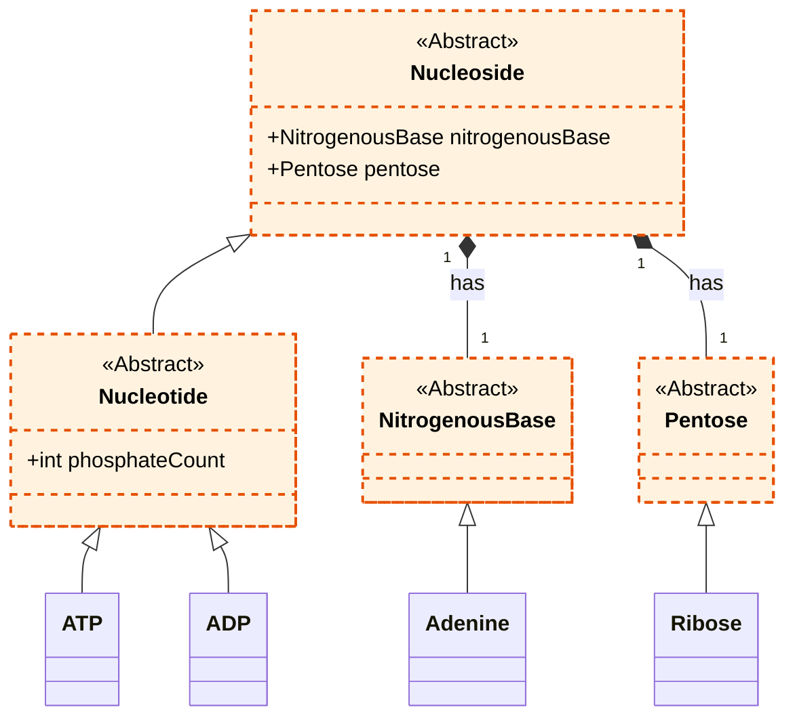

# Nucleotides and Nucleosides Overview

Nucleotides and their precursors, nucleosides, are fundamental biomolecules that serve as the primary building blocks of nucleic acids (DNA and RNA) and play central roles in cellular metabolism.

## Classification

The relationship between these molecules is hierarchical:

1.  **Nucleoside:** This is the base structure, formed by the covalent bonding of two components:
    *   A **Nitrogenous Base** (a purine like Adenine or a pyrimidine like Cytosine).
    *   A **Pentose Sugar** (either Ribose or Deoxyribose).

2.  **Nucleotide:** This molecule is a **phosphorylated nucleoside**. It consists of the two components of a nucleoside plus one to three phosphate groups attached to the pentose sugar.
    *   `Nucleotide = Nucleoside + Phosphate Group(s)`

The most famous example is **Adenosine Triphosphate (ATP)**, the primary energy currency of the cell. It is a nucleotide composed of an Adenine base, a Ribose sugar, and three phosphate groups. Its de-phosphorylated counterpart, **Adenosine Diphosphate (ADP)**, is a key component of the energy cycle.

## Conceptual UML Diagram

The following Mermaid diagram represents the structural hierarchy of nucleosides and nucleotides as modeled in the project.

*Note: Following our UML conventions, conceptual class names omit code-level prefixes.*

